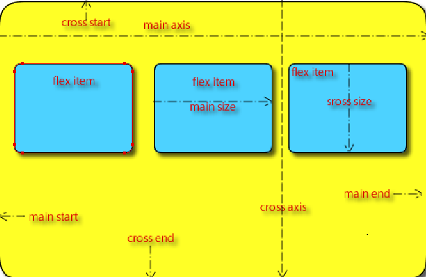
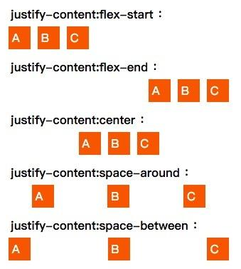

# CSS3

- 伪元素:部分和伪类相同一般用::来区分
- 伪类：与类区分

## CSS3选择器

### 知识点1.全局选择器

- 全局选择器：设置所有标签使用同一样式，用*表示。如：*{margin：0；padding：0}       通配符选择器

### 知识点2.标签选择器

- 标签选择器(元素选择器)：用于声明标记采用的样式。如：p{color:red;}
- 所有的标签，都可以是选择器

### 知识点3.类别选择器

- 类(别)选择器：用来为一系列标签定义相同的样式。
- 一个类别选择器用在多个标签上
- 类别选择器在页面上可以出现多次。

> 步骤：
  a)先使用class定义类名称：如
  `<p>段落一</p>`
  `<p  class="p1">段落二</p>`
  `<p>段落三</p>`
  b)设置并应用样式：
  `<style  type="text/css">`
  .p1{属性：属性值；}
  `</style>`

- 一个标签上可以有多个类别选择器

### 知识点4.Id选择器

- id选择器：和类选择器相似，但要注意同一id名在同一个页面中只能出现一次。

> 步骤：
  a)先使用id定义id选择器名称：如
    `<p>段落一</p>`
    `<p  id="p1">段落二</p>`
    `<p>段落三</p>`
  b)设置并应用样式：
    `<style  type="text/css">`
    `#p1{属性：属性值；}`
    `</style>`

- 任何的HTML标签都可以有id属性。表示这个标签的名字。
- id命名规则：

  1. 只能有字母、数字、下划线
  2. 必须以字母开头
  3. 不能和标签同名。比如id不能叫做body、img、a

### 知识点5.伪类选择器

:link 默认效果
:visited 访问后效果
:hover  鼠标移过效果
:active 被激活的效果

伪类选择器：用伪类定义的样式并不是作用在标记上，而是作用在标记的状态上。

四种状态：（顺序不可变LVHA）

- a)超链接默认效果——a:link{属性：属性值；}
- b)超链接访问后效果——a:visited{属性：属性值；}
- c)鼠标移过超链接效果——a:hover{属性：属性值；}
- d)超链接被激活的效果——a:active{属性：属性值；}

一般 只设置 超链接 默认效果和 鼠标划过的效果：

a{}

a:hover{}

### 知识点6.目标伪类选择器

:target 超链接后目标样式

当使用超链接后，链接的目标可以用目标选择器设置，目标只有被跳转后才会显示对应的样式

```css
:target  {
    font-size:20pt;
    border:1px solid gray;
}
div:target  {
     background-color:#ccc;
}
```

```html
<p><a href="#news1">跳转至内容 1</a></p>
<p><a href="#news2">跳转至内容 2</a></p>
<br /><br /><br />
<a name="news1">内容 1...</a>
<div id="news2">内容 2...</div>
```

### 知识点7.元素伪类选择器

- :enabled，匹配每个已启用的元素（大多用在表单元素上）
- :disabled，匹配每个被禁用的元素（大多用在表单元素上）
- :checked，匹配每个已被选中的 input 元素（只用于单选按钮和复选框）
- 还可以针对`<select>`内的`<option>`

```html
<style>
input:enabled { font-weight:bold;}
input:disabled { background-color:#ccc;color:Gray;}
input:checked {outline:2px solid blue;}
 input:checked+label {outline:2px solid blue; color:red;}
</style>

ID：<input type="text" disabled="disabled" value="333" /><br/><br />
名称：<input type="text" /><br /><br />
状态：<input type="radio" name="state" value="1" /><label for="state">启用</label>
<input type="radio" name="state" checked="checked"  value="0" />停用
```

### 知识点8.结构伪类选择器

- :first-child ，匹配属于其父元素的首个子元素
  - p:first-child  选择属于父元素的第一个子元素的每个 `<p>` 元素
  - li:first-of-type 选择li列表父元素的第一个是li的子元素
- :last-child，匹配属于其父元素的最后一个子元素
  - p:last-child 选择属于父元素的最后一个子元素的每个 `<p>`元素
- :empty ，匹配没有子元素（包括文本节点）的每个元素
  - p:empty  选择没有子元素的每个 `<p>` 元素
- :only-child ，匹配属于其父元素的唯一子元素
  - p:only-child  选择属于其父元素的唯一子元素的每个 `<p>` 元素
  - span:only-of-type(1) 选择没有子元素的每个 `<span>` 元素
- :nth-child(n)，匹配属于父元素的第n个子元素(n>=1)
  - div p:nth-child(2) 选择div标签下第二个子标签 父元素的第2个元素是div子元素,如果不是不选中
  - li:nth-of-type(1) 这里是从第1个开始算，父元素的第一个li子元素

### 知识点9.否定伪类选择器

- :not(selector)  匹配非指定元素/选择器的每个元素

  ```html
  <style>
  input:not([type="text"])
  {
      font-size:15px;
      font-weight:bold;
      color:Red;
  
  }
  </style>
  <input type="text" /><br />
  <input type="button" value="普通按钮" /><br />
  <input type="submit" value="提交" />
  ```

### 知识点10.伪元素

- 伪类存在的意义是为了通过选择器找到那些不存在与DOM树中的信息以及不能被常规CSS选择器获取到的信息。伪类由一个冒号:开头，冒号后面是伪类的名称和包含在圆括号中的可选参数。
- 伪元素在DOM树中创建了一些抽象元素，这些抽象元素是不存在于文档语言里的（可以理解为html源码）。比如：documen接口不提供访问元素内容的第一个字或者第一行的机制，而伪元素可以使开发者可以提取到这些信息。并且，一些伪元素可以使开发者获取到不存在于源文档中的内容。伪元素的由两个冒号::开头，然后是伪元素的名称。
- 简单来说，伪元素创建了一个虚拟容器，这个容器不包含任何DOM元素，但是可以包含内容。

- ::first-letter   选择器用于选取指定选择器的首字母 常用于排版细节，如首字母突出显示、下沉等

  ```html
  <style>
  p::first-letter
  {
      font-size:20pt;
      color:#8A2BE2;
      font-weight:bold;
  }
  </style>
  <h1>h1 文本</h1>
  <p>段落文本111</p>
  <p>段落文本222</p>
  ```

- ::selection 匹配被用户选取(光标选中)的部分

  ```html
  <style>
  div::selection
  {
      color:#f00;
  }
  </style>
  <!-- 页面文本，可以使用鼠标拖拽的方式直接选中，查看效果。 -->
  <p>段落文本</p>
  <div>div中的文本</div>
  ```

- ::first-line 选择器的首行 用于选取指定选择器的首行

  ```html
  <style>
  p::first-line
  {
      font-size:20pt;
      color:#8A2BE2;
      font-weight:bold;
  }
  </style>
  <p>这是一个文本比较多的段落，有多行文本。需要设置第一行文本的特定样式。</p>
  ```

### 知识点11.内容生成器(伪元素)

- content 属性与 :before 及 :after 伪元素配合使用，来插入生成内容
- 常用的取值
- url：图像
- 字符串：纯文本

- *伪类和伪元素可以同时使用*
- ::before  在选择器前增加内容

```html
<style>
p:before{
    content:"台词：";
}
a:before {
    content:url(m1.gif);
    padding-right:5px;
}
</style>
<p>段落1</p>
<p>段落2</p>
<p>段落3</p>
<a href="#">链接1</a><br />
<a href="#">链接2</a>
```

- ::after 在选择器后增加内容

  ```css
  p:after  
  {
  content:url(image/flower.jpg);
  }
  ```

### 知识点12.属性选择器

属性选择器能够将元素附带的属性用于选择器中，从而对带有指定属性的元素设置样式

```css
[title]  
{
color:red;
}
```

- 选择带有 title 属性的所有元素
- E[att] ：选择具有att属性的E元素。

### 知识点13.属性筛选选择器

[id]  附带 id 属性的元素
p[id]  附带 id 属性的 `<p>` 元素
p[id][class]  附带 id 属性和class属性的 `<p>` 元素
p[title="summary"]  附带 id 属性的 `<p>` 元素，其中title 属性的值为summary
p[class~="myClass"]  附带class 属性的 `<p>` 元素，其中 class 属性的值是以空格隔开的单词列表，myClass也是单词列表中的一个单词
p[class^="b"]  class 属性值以 "b" 开头的所有 `<p>` 元素
p[class*="b"]  class 属性值中包含子串 "b" 的所有 `<p>`元素
p[class$="b"]   class 属性值以 "b" 结尾的所有 `<p>` 元素

### 知识点14.群组选择器

- 群组选择器就是用逗号区分如果个标签，所有标签都设置为这个样式
- h1,h2,h3,h4,h5,h6{ color:red; font-size:30px}

### 知识点15.后代选择器

- 后代选择器就是用空格空开标签，标识是该选择器的后代
- E F：选择所有被E元素包含的F元素。
- 与子选择符不同的是，包含选择符将会命中所有符合条件的后代，包括儿子，孙子，孙子的孙子...
- html  div{ bgcolor }    .header  li{} div span{}
- 例如
  - div div {background: orange;}

### 知识点16.子选择器

- E>F：选择所有作为E元素的子元素F。
- p>a{}      p内标签名为a的元素样式

### 知识点17.相邻选择器

- E+F ：选择紧贴在E元素之后F元素。
- 与兄弟选择符不同的是，相邻选择符只会命中符合条件的相邻的兄弟元素。

### 知识点18.兄弟选择器

- 兄弟选择器
- E~F ：选择E元素后面的所有兄弟元素F。 。
- 与相邻选择符不同的是，兄弟选择符会命中所有符合条件的兄弟元素，而不强制是紧邻的元素。

---

## CSS3盒模型

### 怪异盒模型

- box-sizing
  - border-box怪异模式(早期IE浏览器)
    - width + margin(左右)（即width已经包含了padding和border值）
  - content-box标准模式（默认模式）
    - width + margin(左右) + padding(左右) + border(左右)

### overflow溢出显示隐藏

- 可以单独设置在水平方向上或垂直方向上如果内容超出盒的容纳范围时的显示方式。
- overflow属性
    > visible： -可见 对溢出内容不做处理，内容可能会超出容器。（默认）
      hidden：--隐藏  隐藏溢出容器的内容且不出现滚动条。
      scroll：--滚动 隐藏溢出容器的内容，溢出的内容将以卷动滚动条的方式呈现。（不论是  否内容溢出都会显示）
      auto：按需出现滚动条 当内容没有溢出容器时不出现滚动条，当内容溢出容器时出现滚动条，按需出现滚动条。
- overflow-x和overflow-y
    > visible： 对溢出内容不做处理，内容可能会超出容器。
      hidden： 隐藏溢出容器的内容且不出现滚动条。
      scroll： 隐藏溢出容器的内容，溢出的内容将以卷动滚动条的方式呈现。
      auto： 当内容没有溢出容器时不出现滚动条，当内容溢出容器时出现条，按需出现滚动条。

### 文本域禁止改变大小(textarea)

- resize: none;

### 外边线

- outline

---

## CSS3多列布局

### columns

- columns 是一个复合属性，包含 column-width 和 column-count 这两种简写。意 为同时设置分列列数和分列宽度。
- 分成四列，每列宽度自适应
- columns: auto 4;

### column-width

- column-width 属性，用于设置每列的宽度。
- //设置列宽
- column-width: 200px;
- 这里设置了 200px，有点最小宽度的意思。当浏览器缩放到小于 200 大小时，将变成 1 列显示。而如果是 auto，则一直保持四列。

### column-count

- column-count
- column-count 属性，用于设置多少列。
- //设置列数
- column-count: 4;

### column-gap

- column-gap
- column-gap 属性，用于设置列间距
- //设置列间距
- -moz-column-gap: 100px;

### column-rule

- column-rule 属性，设置每列
- 中间的分割线
- //设置列边线
- column-rule: 2px dashed gray;

### 栅栏布局(多列布局)只适用于文本布局 不适合块元素布局

```html
<style>
.div0{
    width: 600px;
    height: 600px;
    /* columns: auto 4; */
    column -width :
    80px;
    column-count: 4;
    column-gap: 10px;
    column-rule: 1px  solid口#000000 ;
    background-color: Orgba(255 ,0,0,0.1);
}
</style>
<div class= "divo">
<div class="div1">< /div>
<div class= "div2"></div>
<div class="div3"></div>
<div class= "div4"></div>
</div>

```

---

## CSS3弹性盒模型

### 知识点1.Flex布局基本概念

- Flex是Flexible Box的缩写，意为”弹性布局”，用来为盒状模型提供最大的灵活性。
- 任何一个容器都可以指定为Flex布局。

- ```css
  div{
  display: flex;
  display: inline-flex;
  display: -webkit-flex; /* Safari，Chrome */
  }
  ```

- 设为Flex布局以后，子元素的float、clear和vertical-align属性将失效。
- 采用Flex布局的元素，称为Flex容器（flex container），简称”容器”。它的所有子元素自动成为容器成员，称为Flex项目（flex item），简称”项目”。容器默认存在两根轴：水平的主轴（main axis）和垂直的交叉轴（cross axis）。主轴的开始位置（与边框的交叉点）叫做main start，结束位置叫做main end；交叉轴的开始位置叫做cross start，结束位置叫做cross end。
- 项目默认沿主轴排列。单个项目占据的主轴空间叫做main size，占据的交叉轴空间叫做cross size。


- Flex布局的好处

  - Flexbox通常能让我们更好的操作他的子元素布局，例如：
  - 如果元素容器没有足够的空间，我们无需计算每个元素的宽度，就可以设置他们在同一行；
  - 可以快速让他们布局在一列； 可以方便让他们对齐容器的左、右、中间等； 无需修改结构就可以改变他们的显示顺序； 如果元素容器设置百分比和视窗大小改变，不用提心未指定元素的确切宽度而破坏布局，因为容器中的每个子元素都可以自动分配容器的宽度或高度的比例。

### 知识点2.Flex容器属性

#### flex-direction

- 指定伸缩容器主轴的伸缩流方向
- 这是用来创建方轴，从而定义
- Flex项目在Flex容器中放置的方向。Flexbox是一种单方向的布局概念。认为Flex项目主要排列方式要么是水平排列，要么是垂直列排列。
- flex-direction: row | row-reverse | column | column-reverse;
- row 和 row-reverse 受 flex 容器的方向性的影响。 如果它的 dir 属性是 ltr，row 表示从左到右定向的水平轴，而 row-reverse 表示从右到左; 如果 dir 属性是 rtl，row 表示从右到左定向的轴，而 row-reverse 表示从左到右。
  - row(默认值):如果书写方式是ltr，那么Flex项目从左向右排列；如果书写方式是rtl，那么Flex项目从右向左排列
  - row-reverse:如果书写方式是ltr，那么Flex项目从右向左排列；如果书写方式是rtl，那么Flex项目从左向右排列
  - column:和row类似，只不过方向是从上到下排列
  - column-reverse:和row-reverse类似，只不过方向是从下向上排列

#### flex-wrap

- 指定伸缩项目是否沿着侧轴排列
- 默认情况之下，Flex项目都尽可能在一行显示。你可以根据flex-wrap的属性值来改变，让Flex项目多行显示。方向在这也扮演了一个重要角度，决定新的一行堆放方向。
- flex-wrap: nowrap | wrap | wrap-reverse;

  - nowrap(默认值):单行显示，如果书写方式是ltr，Flex项目从左向右排列，反之rtl，从右向左排列
  - wrap:多行显示，如果书写方式是ltr，Flex项目从左向右排列，反之rtl，从右向左排列
  - wrap-reverse:多行显示，如果书写方式是ltr，Flex项目从右向左排列，反之rtl，从左向右排列

#### flex-flow

- 适用于flex容器元素
- 这是flex-direction和flex-wrap两个属性的缩写。两个属性决定了伸缩容器的主轴与侧轴。默认值是row nowrap（中间用空格隔开）。

#### justify-content

- 主轴上对齐伸缩项目
- 用于在主轴上对齐伸缩项目。这一行为会在所有可伸缩长度及所有自动边距均被解释后进行。当一行上的所有伸缩项目都不能伸缩或可伸缩但是已经达到其最大长度时，这一属性才会对多余的空间进行分配。当项目溢出某一行时，这一属性也会在项目的对齐上施加一些控制。
- justify-content: flex-start | flex-end | center | space-between | space-around | space-evenly;
- flex-start(默认值):左对齐
- flex-end:右对齐
- center:居中对齐
- space-between:两侧顶边，均分宽度位置,分散对齐米
- space-around:两则留有间隙,并均分宽度位置,分散对齐
- space-evenly:均分所有宽度，间隙完全相同，分散对齐


#### align-items

指定伸缩项目沿着侧轴对齐方式

伸缩项目可以在伸缩容器的当前行的侧轴上进行对齐，这类似于justify-content属性，但是是另一个方向。align-items可以用来设置伸缩容器中包括匿名伸缩项目的所有项目的对齐方式。

- align-items: flex-start | flex-end | center | baseline | stretch;
  - flex-start:
  - flex-end:
  - center:
  - baseline:垂直各元素底边对齐(无文字),有文字时,沿文字位置对齐
  - stretch:

#### align-content

- 多根轴线的对齐方式
- 当伸缩容器的侧轴还有多余空间时，align-content属性可以用来调准伸缩行在伸缩容器里的对齐方式，这与调准伸缩项目在主轴上对齐方式的justify-content属性类似。
- 请注意本属性在只有一行的伸缩容器上没有效果。

```css
{
/* 基本位置对齐 */
/*align-content不采用左右值 */
align-content: center;     /* 将项目放置在中点 */
align-content: start;      /* 最先放置项目 */
align-content: end;        /* 最后放置项目 */
align-content: flex-start; /* 从起始点开始放置flex元素 */
align-content: flex-end;   /* 从终止点开始放置flex元素 */

/* 默认对齐 */
align-content: normal;

/*基线对齐*/
align-content: baseline;
align-content: first baseline;
align-content: last baseline;

/* 分布式对齐 */
align-content: space-between; /* 均匀分布项目 第一项与起始点齐平， 最后一项与终止点齐平 */
align-content: space-around;  /* 均匀分布项目 项目在两端有一半大小的空间*/
align-content: space-evenly;  /* 均匀分布项目 项目周围有相等的空间 */
align-content: stretch;       /* 均匀分布项目拉伸‘自动’-大小的项目以充满容器 */

/* 溢出对齐 */
align-content: safe center;
align-content: unsafe center;

 /* 全局属性 */
align-content: inherit; /* 继承 */
align-content: initial;  /* 初始值 */
align-content: unset; /* 未设置 */
}
```

注意：只有多行的伸缩容器才会在侧轴上有多余的空间以供对齐，因为仅包含一行的伸缩容器中，唯一的一行会自动伸展填充全部的空间。

### 知识点3.Flex项目属性

#### order

#### flex-grow

#### flex-shrink

#### flex-basis

#### flex

#### align-self

### 知识点4.常用应用（居中对齐，自适应导航，移动优先布局）

居中对齐
自适应导航
移动优先布局

---

## CSS3变换

transform
第1项.transform-origin转换原点
第2项.translate位移
第3项.scale缩放
第4项.Rotate旋转
    rotateY
    perspective透镜
第5项.Skew倾斜（skewX，skewY）
立方体

---

## CSS过渡动画

- 过渡动画（transition）
    transition-property
        none
        all
        指定样式属性
    transition-duration
    transition-timing-function
        ease
        linear
        ease-in
        ease-out
        ease-in-out
        cubic-bezier
            （该值允许你去自定义一个时间曲线）， 特定的cubic-bezier曲线。 (x1, y1, x2, y2)四个值特定于曲线上点P1和点P2。所有值需在[0, 1]区域内，否则无效。
            其是cubic-bezier为通过贝赛尔曲线来计算“转换”过程中的属性值，如下曲线所示，通过改变P1(x1, y1)和P2(x2, y2)的坐标可以改变整个过程的Output Percentage。初始默认值为default.
            [获取贝塞尔方法工具](http://cubic-bezier.com/)
    transition-delay
    transition 简写
    百叶窗效果
- 知识点2.动画（animation ）
  - 第1项.animation 与关键帧
        animation 属性
            animation-name 规定需要绑定到选择器的 keyframe 名称。。
            animation-duration 规定完成动画所花费的时间，以秒或毫秒计。
            animation-timing-function 规定动画的速度曲线。
                ease
                linear
                ease-in
                ease-out
                ease-in-out
            animation-delay 规定在动画开始之前的延迟。
            animation-iteration-count 规定动画应该播放的次数。
            animation-direction 规定是否应该轮流反向播放动画。
                normal
                alternate一次前一次后交替效果
            animation-fill-mode 结束后不返回
                forwards 结束停留在最后一帧
                none
        关键帧 @keyframes
  - 第2项.animate css插件的使用
        1、首先引入animate css文件
            `<link rel="stylesheet" href="animate.min.css">`
        2、给指定的元素加上指定的动画样式名
            `<div class="animated bounceOutLeft"></div>`
            这里包括两个class名，第一个是基本的，必须添加的样式名，任何想实现的元素都得添加这个。第二个是指定的动画样式名。
        3、如果说想给某个元素动态添加动画样式，可以通过jquery来实现：
            $('#yourElement').addClass('animated bounceOutLeft');

## CSS3媒体查询

- 什么是媒体查询
    媒体查询可以让我们根据设备显示器的特性（如视口宽度、屏幕比例、设备方向：横向或纵向）为其设定CSS样式，媒体查询由媒体类型和一个或多个检测媒体特性的条件表达式组成。媒体查询中可用于检测的媒体特性有 width 、 height 和 color （等）。使用媒体查询，可以在不改变页面内容的情况下，为特定的一些输出设备定制显示效果。
- 为什么响应式设计需要媒体查询
    如果没有CSS3的媒体查询模块，就不能针对设备特性（如视口宽度）设置特定的CSS样式
- 如何在CSS文件中引入媒体查询
    媒体查询写在CSS样式代码的最后，CSS是层叠样式表，在同一特殊性下，靠后的的样式会重叠前面的样式
- 媒体查询的语法

```html
<!-- link元素中的CSS媒体查询 -->
`<link rel="stylesheet" media="(max-width: 800px)" href="example.css" />`
    <!-- 样式表中的CSS媒体查询 -->
<style>
@media (max-width: 600px) {
    .facet_sidebar {
    display: none;
    }
}
</style>
```

- 逻辑操作

  - and，且的关系，当所有的条件满足的时候返回true
   @media tv and (min-width:700px) and (orientation:landscape){}
  - 逗号分割列表，或的关系，只要有条件满足就返回ture
   @media (min-width:700px),handheld and (orientation:lanscape){}
  - not，类似于取反，最后参与运算的运算符
  - only，only关键字防止老旧的浏览器不支持带媒体属性的查询而应用到给定的样式
- 设备类型
  - screen 计算机屏幕（默认值）
  - tty  电传打字机以及使用等宽字符网格的类似媒介
  - tv   电视类型设备（低分辨率、有限的屏幕翻滚能力）
  - projection   放映机
  - handheld  手持设备（小屏幕、有限的带宽）
  - print  打印预览模式 / 打印页
  - braille  盲人用点字法反馈设备
  - aural 语音合成器
  - all  适合所有设备
- 媒体查询参数
  - width:浏览器可视宽度，
  - height:浏览器可视高度，
  - device-width:设备屏幕的宽度，
  - device-height:设备屏幕的高度，
  - orientation:检测设备目前处于横向还是纵向状态，
  - aspect-ratio:检测浏览器可视宽度和高度的比例(例如：aspect-ratio:16/9)，
  - device-aspect-ratio:检测设备的宽度和高度的比例，
  - color:检测颜色的位数（例如：min-color:32就会检测设备是否拥有32位颜色），
  - color-index:检查设备颜色索引表中的颜色（他的值不能是负数），
  - monochrome:检测单色楨缓冲区域中的每个像素的位数（这个太高级，估计咱很少会用的到），
  - resolution:检测屏幕或打印机的分辨率(例如：min-resolution:300dpi或min-resolution:118dpcm)，
  - grid：检测输出的设备是网格的还是位图设备。

---

## WEB字体

- CSS3 @font-face 规则
- 在 CSS3 之前，web 设计师必须使用已在用户计算机上安装好的字体。
- 通过 CSS3，web 设计师可以使用他们喜欢的任意字体。
- 当您您找到或购买到希望使用的字体时，可将该字体文件存放到 web 服务器上，它会在需要时被自动下载到用户的计算机上。
- 您“自己的”的字体是在 CSS3 @font-face 规则中定义的。

```html
<style>
@font-face {
font-family: myFirstFont;
src: url('Sansation_Light.ttf'),
     url('Sansation_Light.eot'); /* IE9+ */
font-weight: bold;
}

div {
 font-family: myFirstFont;
}
</style>
```

CSS3 字体描述符
|属性          |描述                                                   |
|---------------|--------------------------------------------------------|
| font-family    | *name*                                                       | 必需。规定字体的名称。                                       |
| src           | *URL*                                                        | 必需。定义字体文件的 URL。                                   |
| font-stretch  | normal/condensed/ultra-condensed/extra-condensed/semi-condensed/expanded/semi-expanded/extra-expanded/ultra-expanded | 可选。定义如何拉伸字体默认是 "normal"。                    |
| font-style    | ormal/italic/oblique                                         | 可选。定义字体的样式。默认是 "normal"。                      |
| font-weight   | normal/bold/100/200/300/400/500/600/700/800/900              | 可选。定义字体的粗细。默认是 "normal"。                      |
| unicode-range | *unicode-range*   | 可选。定义字体支持的 UNICODE 字符范围。默认是 "U+0-10FFFF"。 |

---

## CSS边框线

### border-radius

- border-left-radius
- border-top-radius
- border-right-radius
- border-top-left-radius
- border-top-right-radius
- border-bottom-radius
- border-bottom-left-radius
- border-bottom-right-radius

### box-shadow

- h-shadow 必需。水平阴影的位置。允许负值。
  - 是指阴影水平偏移量其值可以取正负值，如果值为正值，则阴影在对象的右边，反之其值为负值时，阴影在对象的左边；
- v-shadow 必需。垂直阴影的位置。允许负值。
  - 是指阴影的垂直偏移量，其值也可以是正负值，如果为正值，阴影在对象的底部，反之其值为负值时，阴影在对象的顶部；
- blur 可选。模糊距离。
  - 此参数是可选，，但其值只能是为正值，如果其值为0时，表示阴影不具有模糊效果，其值越大阴影的边缘就越模糊；
- spread 可选。阴影的尺寸。
  - 此参数可选，其值可以是正负值，如果值为正，则整个阴影都延展扩大，反之值为负值时，则缩小；
- color 可选。阴影的颜色。请参阅 CSS 颜色值。
  - 此参数可选，如果不设定任何颜色时，浏览器会取默认色，但各浏览器默认色不一样，特别是在webkit内核下的safari和chrome浏览器将无色，也就是透明，建议不要省略此参数。
- inset 可选。将外部阴影 (outset默认) 改为内部阴影。(内嵌效果)
  - 此参数是一个可选值，如果不设值，其默认的投影方式是外阴影；如果取其唯一值“inset”,就是将外阴影变成内阴影，也就是说设置阴影类型为“inset”时，其投影就是内阴影；
- box-shadow: h-shadow v-shadow blur spread color inset;
- 边框效果

  ```css
  div
  {
      width: 100px;
      height: 100px;
      background-color: red;
      margin: 50px;
      border: 5px solid #FFFFF;
      outline: 10px solid #000000;
      box-shadow: 0px 0px 0px 20px #CCCCCC ;
  }
  
  ```

### border-image

- 图片创建边线

```css
div {
-webkit-border-image:url(border.png) 30 30 round; /* Safari 5 */
-o-border-image:url(border.png) 30 30 round; /* Opera */
border-image:url(border.png) 30 30 round;
}
```

|属性            |描述                                                   |
|---------------|--------------------------------------------------------|
| border-image-source | 用在边框的图片的路径。                                       |
| border-image-slice  | 图片边框向内偏移。                                           |
| border-image-width  | 图片边框的宽度。                                             |
| border-image-outset | 边框图像区域超出边框的量。                                   |
| border-image-repeat | 图像边框是否应平铺(repeated)、铺满(rounded)或拉伸(stretched)。 |

---

## CSS背景属性

|属性          |描述                                                   |
|---------------|--------------------------------------------------------|
| background-clip   | 规定背景的绘制区域。     |
| background-origin | 规定背景图片的定位区域。 |
| background-size   | 规定背景图片的尺寸。     |

```css
div
{
    background-image: url("./img/IMG_20170529_115817.jpg");
    width: 800px;
    height: 600px;
    background-size: 100% 100%;
    border: 10px dashed #ccc;
    padding: 20px;
}
div:nth-child(1){
    background-clip: content-box;
}
div:nth-child(2){
    background-clip: padding-box
}
div:nth-child(3){
    background-clip: border-box;
    background-origin: border-box;
}
```

---

## CSS文本

|属性                 |描述                                                   |
|--------------------|--------------------------------------------------------|
|hanging-punctuation | 规定标点字符是否位于线框之外。                           |
| punctuation-trim    | 规定是否对标点字符进行修剪。                             |
| text-align-last     | 设置如何对齐最后一行或紧挨着强制换行符之前的行。          |
| text-emphasis       | 向元素的文本应用重点标记以及重点标记的前景色。            |
| text-justify        | 规定当 text-align 设置为   "justify" 时所使用的对齐方法。 |
| text-outline        | 规定文本的轮廓。 (主流浏览器不支持)                      |
| text-overflow       | 规定当文本溢出包含元素时发生的事情。                     |
| text-shadow         | 向文本添加阴影。 (主流浏览器不支持)                      |
| text-wrap           | 规定文本的换行规则。                                    |
| word-break          | 规定非中日韩文本的换行规则。                             |
| word-wrap           | 允许对长的不可分割的单词进行分割并换行到下一行。           |

---

## CSS3渐变

### 线性渐变（Linear Gradients）

- background:linear-gradient(to bottom,red,yellow);
  - 第一个参数可指定的参数值如下：

  |参数值      |渐变方向|
  |-----------|-------|
  |to bottom  |从上往下|
  |to  right  |从左往右|
  |to  top    |从下往上|
  |to  left   |从右往左|

  - 第二个参数和第三个参数分别表示渐变的起点色和终点色。
    - repeating-linear-gradient(red, yellow 10%, green 20%);

- 向下/向上/向左/向右/对角方向
  - linear-gradient(red, blue);从上到下
  - linear-gradient(to right, red , blue);从左到右
  - linear-gradient(to bottom right, red , blue);对角
  - linear-gradient(180deg, red, blue);角度
  - linear-gradient(red, green, blue);使用多个颜色节点
  - linear-gradient(to right, rgba(255,0,0,0), rgba(255,0,0,1));使  - 透明度
  - repeating-linear-gradient(red, yellow 10%, green 20%);重复的线性  - 变

### 径向渐变（Radial Gradients）

- background:radial-gradient(red,yellow);
  - 第一个参数和第二个参数分别表示渐变的起点色和终点色。
  - background:radial-gradient(circle at left top,red,yellow);

- 由它们的中心定义
  - background: radial-gradient(red, green, blue);颜色结点均匀分布
  - radial-gradient(red 5%, green 15%, blue 60%);颜色结点不均匀分布
  - radial-gradient(circle, red, yellow, green);设置形状
  - radial-gradient(60% 55%, **closest-side**,blue,green,yellow,black)
  - size 参数定义了渐变的大小
    它可以是以下四个值：
    - **closest-side**
    - **farthest-side**
    - **closest-corner**
    - **farthest-corner**
  - repeating-radial-gradient(red, yellow 10%, green 15%)重复的镜像渐变

---
